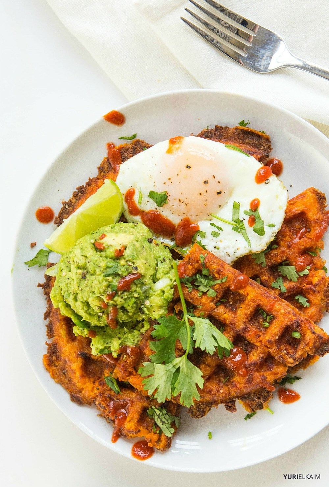

# Sweet Potato Waffles

## Ingredients

* 1 sweet potato (about 1.5 cups peeled and grated)
* 2 large eggs (divided)
* 2 tbsp coconut flour
* 1 ripe avocado
* 2 green onions (finely diced)
* 1 lime (freshly squeezed)
* 2 tbsp fresh cilantro (chopped)
* hot sauce (optional)
* sea salt and pepper
* coconut oil cooking spray

# Method

1. Preheat waffle iron. In a large bowl, stir together grated sweet potato, one egg, coconut flour and 1/2 teaspoon salt.
1. Spray waffle iron generously with nonstick spray. Spoon one half of the sweet potato mixture into the center of the waffle iron. Close the lid and cook for 5-8 minutes, or until the waffle begins to turn medium golden brown. Remove waffle and repeat with second half of the batter.
1. While waffles cook, poach or fry eggs. Peel and pit avocado. Mash together with diced green onions and lime juice. Add salt and pepper to taste.
1. Drizzle with hot sauce, if desired.

[Reference Link](https://yurielkaim.com/sweet-potato-waffles/)