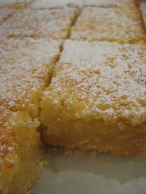

# Sticky Lemon Slice

This slice is quite similar to a lemon tart. It was delicious - very gooey and lived up to its name in stickiness. In fact it was so sticky and gooey that I got 'told off' for eating it too loudly! It is quite sweet, so nice to have with a cuppa - I had it with a peppermint tea, which complimented it nicely

## Ingredients

### Base

* 225g butter, softened
* 70g icing sugar
* 275 standard flour

### Topping

* 400g sugar
* 4 medium sized eggs, beaten
* 4 tbsp standard flour
* 1 tsp baking powder
* grated zest of 2 lemons
* 90ml lemon juice, strained
* icing sugar

## Method

1. Preheat oven to 170C. Line the base of a non-stick 32 x 21cm tin with baking paper. For the base: process butter in food processor until whipped. then add icing sugar until light in colour. Sprinkle in the flower and process until the mixture forms a ball. Tip into the tin an press flat. Bake for 15 mins, then remove from the oven. While the vase is cooling, make the topping.
1. Topping: Process eggs and sugar in food processor for 1 minute. Transfer the mixture to a bowl, then sprinkle the flour and baking powder over the top. Add the lemon zest and juice, mixing it all together with a large spoon. Pour the mixture on top of the base (it will fill the tin).
1. Bake for 30-35 minutes, or until golden in colour and firmish to touch. Cool in the tin, then dust with icing sugar and cut into squares. Transfer to an airtight container when cool. This slice will keep for 3-5 days.
