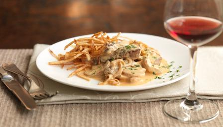

# Beef Stroganoff

## Ingredients

* 675g/1½ lb beef fillet, preferably cut from the tail end
* 65g/2½oz unsalted butter
* 1½ tbsp paprika (hot Hungarian, if you like a little subtle heat)
* 1 large onion, very thinly sliced
* 350g/12oz button mushrooms, thinly sliced
* 3 tbsp sunflower oil
* 300ml/10fl oz soured cream
* 2 tsp lemon juice
* small handful of parsley leaves, finely chopped
* salt
* freshly ground black pepper

## Method

1. Cut the steak into slices 1cm/0.5in thick, then cut each slice across the grain into strips 1cm/0.5in wide.
2. For the matchstick potatoes, cut the potatoes by hand into short sticks 3mm/0.2in thick or use a mandolin. Set aside in a bowl of cold water.
3. Heat the sunflower oil for deep-frying, either in a large pan or in a deep-fat fryer, to 190C/375F.
4. Meanwhile, melt the butter in a large frying pan, add the paprika and onion and cook slowly until the onion is soft and sweet, but not browned.
5. Add the mushrooms and fry gently for three minutes. Transfer the mixture to a plate and keep warm.
6. Drain the matchstick potatoes and dry thoroughly in a clean tea towel or a salad spinner. 
7. Plunge the potatoes into the hot oil and fry for three minutes, until crisp and golden. Drain briefly on kitchen paper and keep hot in a low oven.
8. Using the same pan you cooked the onion mixture in, heat one and a half tablespoons of sunflower oil until very hot. 
9. Add half the fillet steak and fry quickly, seasoning and turning it as you do so, for just over one minute. Transfer to a plate and repeat with the rest of the oil and steak.
10. Return the onion mixture to the pan and pour in the soured cream. Bring to the boil and simmer for a minute or so, until thickened.
11. Return the steak to the pan and heat very gently for one minute - the beef should not be cooked any further.
12. Stir in the lemon juice and parsley and serve with the matchstick potatoes.
