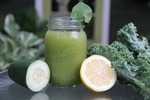

# Green Lemonade

## Ingredients

* Apples - 2 medium (3" dia)
* Cucumber - 1 cucumber (8-1/4")
* Kale - 4 leaf (8-12")
* Lemon - 1 fruit (2-1/8" dia)
* Spinach - 2 cup

## Method

Process all ingredients in a juicer, shake or stir and serve.
