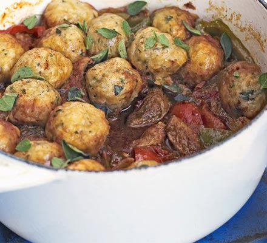

# Pork goulash with herby dumplings

## Ingredients

* 2 tbsp olive oil
* 1½ kg pork tenderloins , cut into strips
* 2 onions , cut into thin wedges
* 4 garlic cloves , crushed
* 1-2 tbsp smoked paprika
* 500ml beef stock
* 2 x 400g cans chopped tomatoes
* 1 tbsp sugar
* 3 peppers , chopped

### For the Dumplings

* 250g self-raising flour
* 140g shredded suet
* 1½ tsp baking powder
* small bunch oregano , most leaves chopped

## Method

1. Heat half the oil in a large frying pan and fry the pork for 4-5 mins until browned. Once done, remove and set aside. You may need to do this in batches. Use remaining oil to fry the onions for 8-10 mins until soft and starting to brown. Then add the garlic and paprika, and cook for 1-2 mins more. Return the pork to the pan and pour in the stock, tomatoes and sugar. Bring to the boil, then turn down and simmer for 20-30 mins until the sauce has thickened.
1. To make the dumplings, combine all the ingredients, apart from the oregano leaves, with enough cold water to make a scone-like dough. Roll into approximately 30 walnut-size balls. Stir the peppers into the goulash. Tuck in the dumplings, cover the pan with a lid and cook for 25-30 mins until the dumplings are puffed up. Allow to cool and freeze for up to 2 months, or serve scattered with reserved oregano and some soured cream.
1. If frozen, defrost then re-heat in the microwave on medium for 4-6 mins for a single portion, and longer for larger servings or gently on the hob, covered, until piping hot.