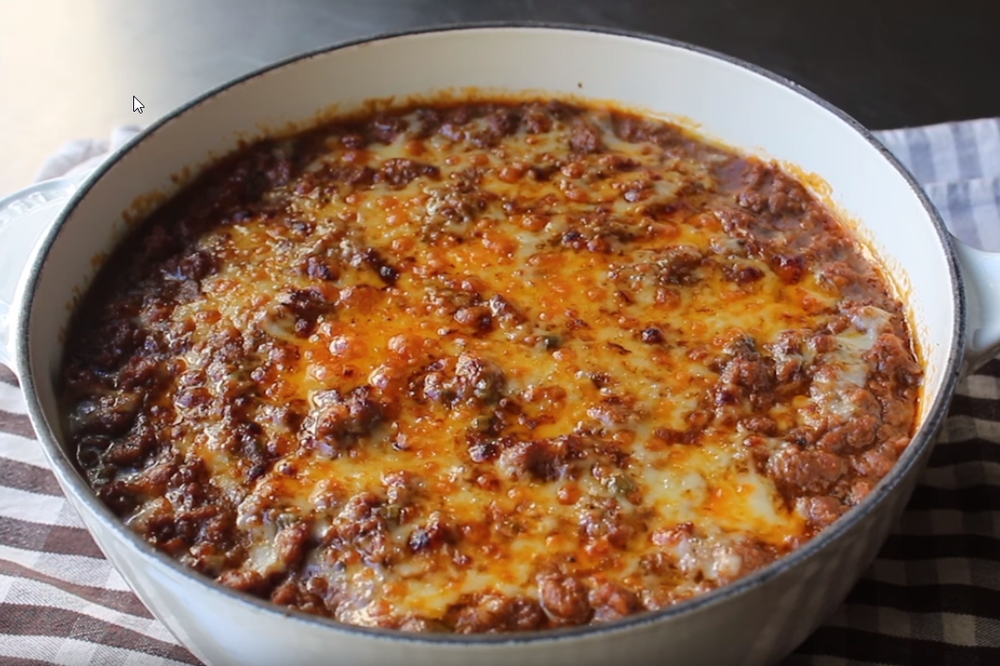

# Sloppy Dip

## Ingrediants

* 2 pound extra lean ground beef
* 1 onion, diced
* 2 diced green bell pepper (1 cup)
* 4 cloves garlic, minced
* 2 teaspoons kosher salt, or to taste
* 1 teaspoon ground black pepper
* 3 tablespoons all-purpose flour
* 2 tablespoons brown sugar
* cayenne to taste
* 1 cup ketchup
* 2 cups chicken broth or water
* 1 tablespoon Dijon mustard
* 1 teaspoon Worcestershire sauce
* 1 cup shredded cheddar cheese, divided

Simmer and reduce heat to medium heat cook, stirring occasionally, 45 minutes or until thick

## Method

1. Transfer to  a dish that will be used to serve.
1. Top with cheese and poke in half of the cheese before adding in more cheese.
1. Cheese best is sharp cheddar