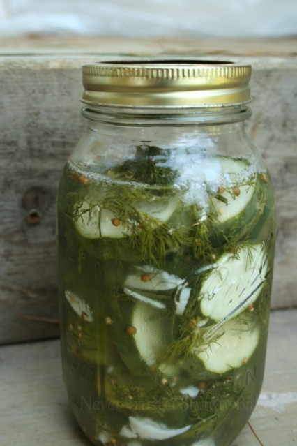

# Refrigerator Pickles

## Ingrediants

* 3 cups distilled white vinegar
* 1/4 cup granulated sugar
* 2 tbsp kosher salt
* 1 tbsp of pickling spice (or 1 tsp each of mustard, coriander, and dill seeds)
* 2 cups hot water
* 2 pounds pickling cucumbers, sliced 1/4-inch thick
* 1 bunch of chopped fresh dill
* 3 cloves garlic, roughly chopped

## Instructions

1. Combine your vinegar, sugar, salt, and pickling spice in a large bowl. Pour the hot water over the vinegar mixture, and mix until the sugar is dissolved. Cool to room temperature.
1. Chop your cucumbers into ¼ inch slices, and divide them into jars (mine fit perfectly into 3 quart size jars). Chop the dill and the garlic, and divide it evenly between your jars.
1. Pour the cooled brine over the cucumbers. If the brine doesn’t quite cover the cucumbers, add more water/vinegar mixture (I just mixed 1 part water to 1 part vinegar). Place the jars in the fridge overnight.
1. hey’re ready to eat after 24 hours, and will keep in the fridge for 2 weeks.
